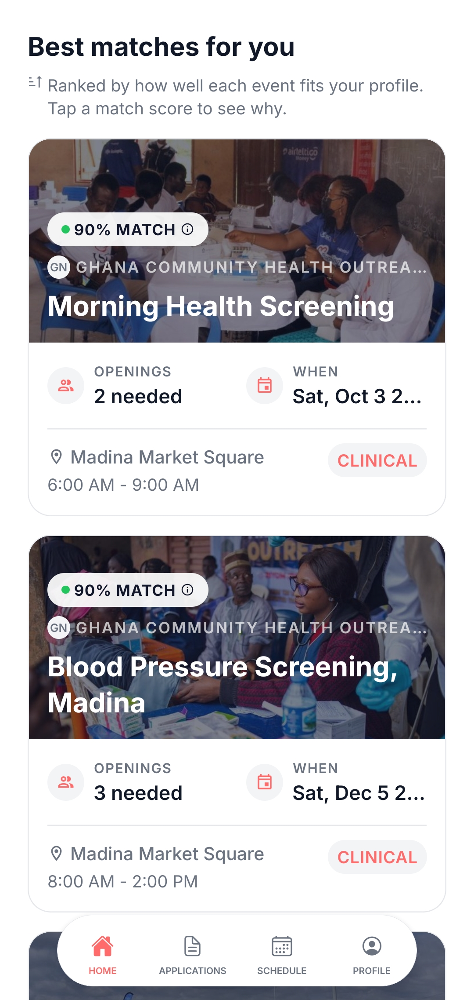
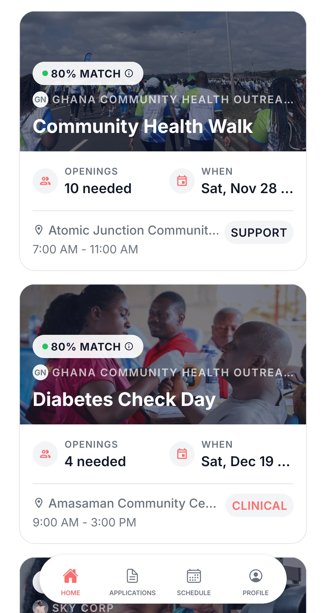
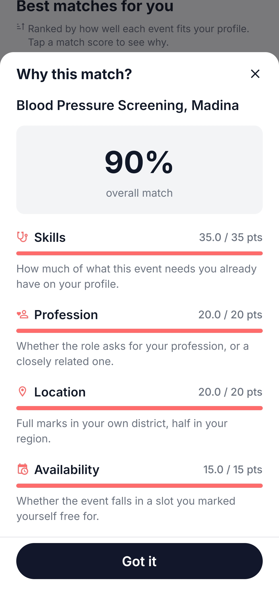
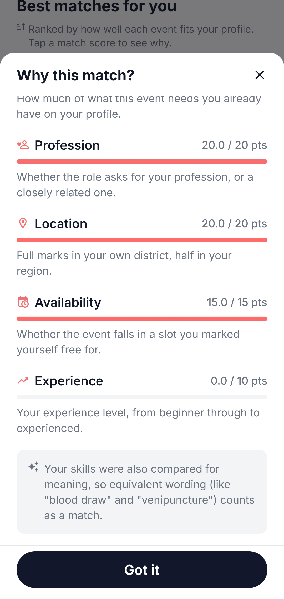
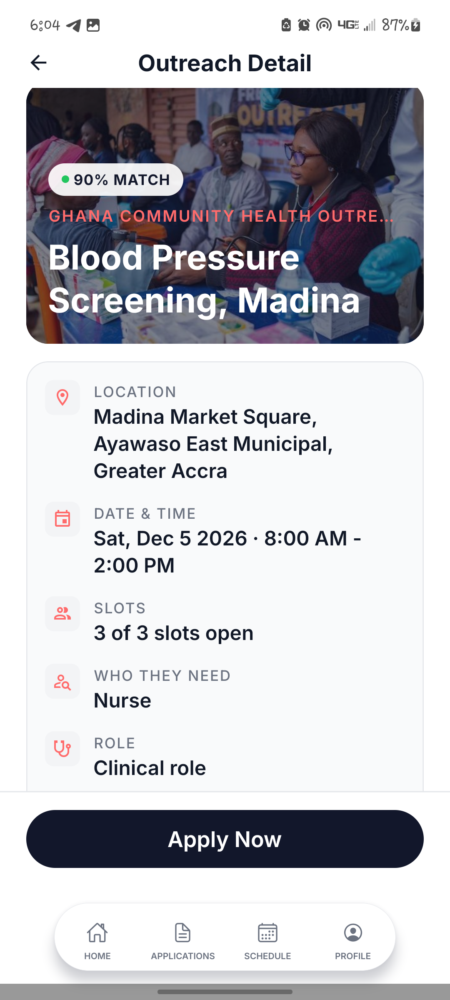
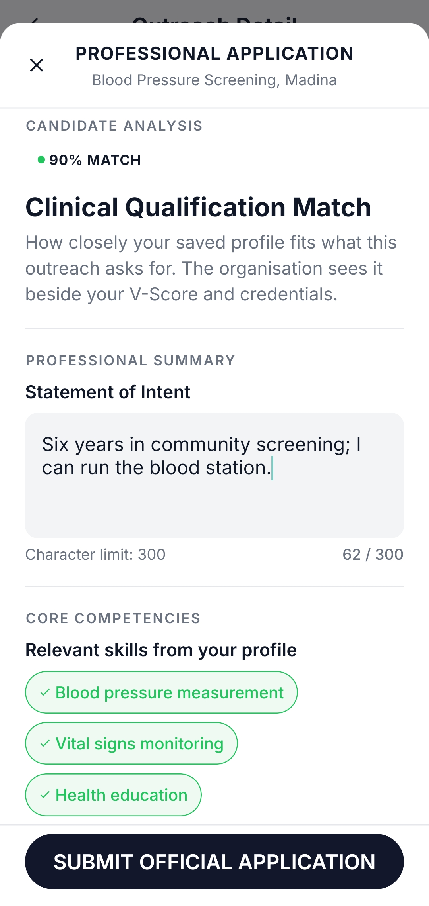
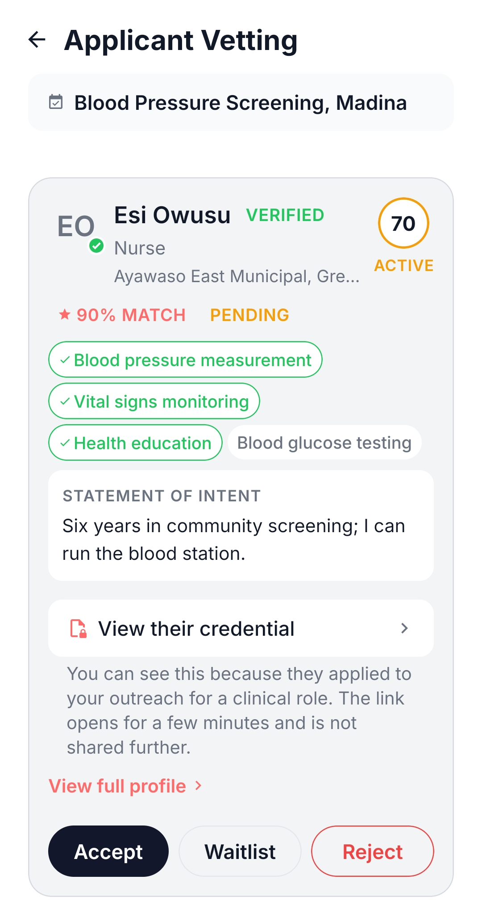
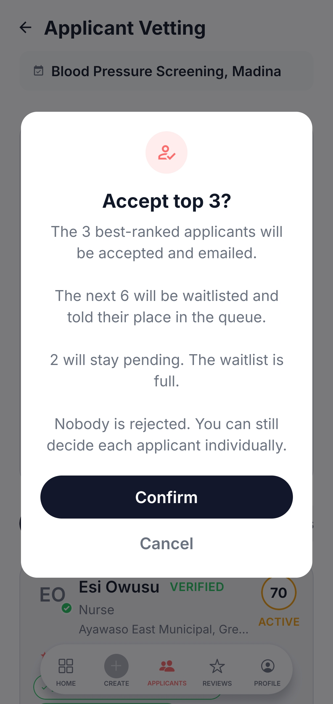
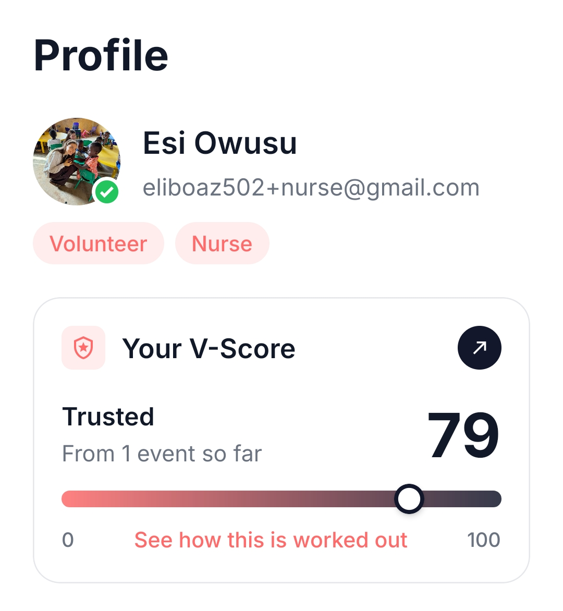
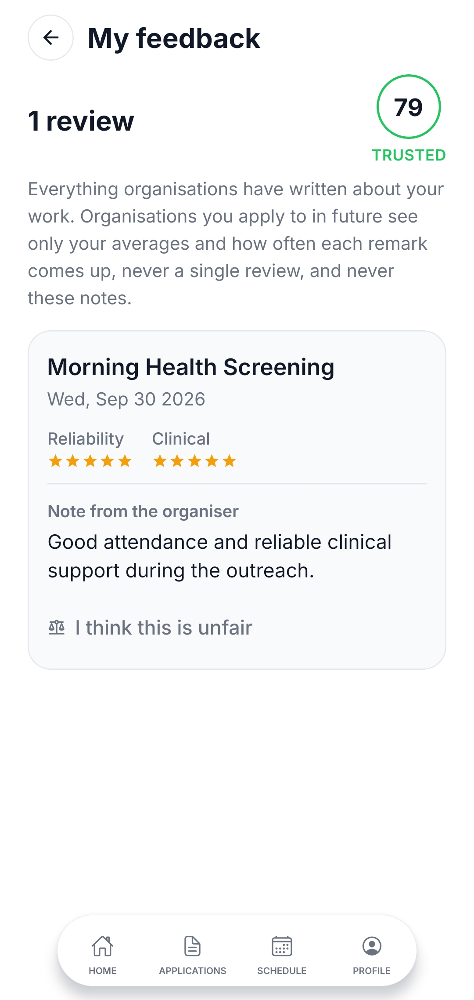

<p align="center">
  
</p>

<h1 align="center">VHub</h1>

<p align="center">
  <strong>Connecting Volunteers. Transforming Healthcare.</strong>
</p>

<p align="center">
  <a href="https://vhub-mu.vercel.app">Website</a> ·
  <a href="https://vhub-mu.vercel.app/download">Download for Android</a> ·
  <a href="https://vhub-mu.vercel.app/faq">FAQ</a>
</p>

---

## About VHub

VHub connects health volunteers — doctors, nurses, midwives, pharmacists, allied health professionals, health and medical students, and trained first aiders — with organisations running medical outreaches across all sixteen regions of Ghana.

Volunteers see the outreaches that fit them first. Organisations see the applicants who fit their event first. Verification, applications, reminders, check-in, attendance and reviews all happen in the same app, making outreach coordination more structured and accountable.

VHub is designed around three problems common to health outreach coordination: opportunities are difficult for volunteers to discover, clinical suitability is difficult for organisers to assess consistently, and unreliable attendance often leaves no continuing record.

The platform addresses these through a personalised outreach feed, a two-layer matching engine, clinical-role verification and the V-Score reliability system.

## For Volunteers

- **A feed ranked for you.** Candidate outreaches are scored against your skills, professional category, location, availability and experience, with the strongest matches shown first.
- **Quick Join for support roles.** Eligible support opportunities can be joined without going through the clinical application process.
- **Clinical roles, done properly.** Hands-on roles require administrator-approved credentials. Once verified, you can apply to clinical roles compatible with your professional category and skills.
- **Pick your days.** On a multi-day campaign, commit only to the days you can attend and release individual days if plans change.
- **Always know where you stand.** Receive application updates, see your live waitlist position, get reminders before an outreach and check in by scanning a QR code at the venue.
- **A V-Score that follows your work.** Reliability is tracked over time using attendance, post-event reviews and confirmed cancellation behaviour. Every volunteer starts at 70.

## For Organisations

- **Post an outreach in minutes.** Add dates, venue, required skills, volunteer categories and the number of places available.
- **Several roles on one event.** One outreach can request different numbers of doctors, nurses, midwives, pharmacists, allied health professionals, students, first aiders and support volunteers.
- **Applicants ranked for you.** Applicants are ordered using their match with the outreach together with the reliability multiplier associated with their V-Score band.
- **Accept your best in one action.** Accept Top N confirms the highest-ranked applicants and places the next eligible applicants on the waitlist. Additional applicants remain pending rather than being automatically rejected.
- **Fewer empty places.** When an accepted volunteer withdraws, the highest-ranked eligible person on the waitlist can be promoted automatically.
- **Attendance and reviews.** Organisations record attendance and complete post-event reviews that contribute to each volunteer's reliability history.

## App Screenshots

### Ranked Outreach Feed

<p align="center">
  
  &nbsp;&nbsp;
  
</p>

Volunteers see available outreaches ordered by how well each opportunity matches their profile.

### Match Score Breakdown

<p align="center">
  
  &nbsp;&nbsp;
  
</p>

The **Why this match?** view shows how skills, professional category, location, availability and experience contribute to the final match score.

### Outreach Details and Application

<p align="center">
  
  &nbsp;&nbsp;
  
</p>

Volunteers can review outreach requirements and apply through the appropriate route, including Full Application for clinical roles and Quick Join for eligible support roles.

### Ranked Applicants and Accept Top N

<p align="center">
  
  &nbsp;&nbsp;
  
</p>

Organisations see applicants in ranked order and can confirm the strongest applicants through the Accept Top N workflow.

### V-Score and Feedback History

<p align="center">
  
  &nbsp;&nbsp;
  
</p>

Volunteers can see their current V-Score, reliability band and feedback from completed outreaches.

## Trust and Privacy

- Every organisation must be verified by an administrator before it can publish an outreach.
- Organisation verification can include a check against the Health Facilities Regulatory Agency (HeFRA) register where applicable.
- Volunteers applying for clinical roles must submit credential evidence for administrator review.
- Verification documents are stored privately and accessed through short-lived signed links.
- Volunteer contact information is restricted to authorised workflows rather than being publicly exposed.
- Check-in performs a one-time location comparison with the outreach venue and records the result of that check.
- Disputes, moderation, verification and account-management workflows are built into the platform.
- Administrative decisions are recorded for accountability.

## How Matching Works

VHub uses a two-layer matching engine.

### Layer 1 — Deterministic Scoring

Each candidate outreach is scored for a volunteer out of 100:

```text
Skills × 35
+ Professional Category × 20
+ Location × 20
+ Availability × 15
+ Experience × 10
```

The five components are calculated using explicit rules, making the result transparent and explainable.

Skills receive the largest weight because they indicate whether the volunteer can perform the work required by the outreach. Professional category, location, availability and experience provide the remaining suitability information.

For an outreach with several roles, a volunteer is scored against each applicable role and the strongest score is used.

### Layer 2 — Semantic Skill Matching

Exact wording is not always enough to recognise the same clinical skill.

For example:

```text
venipuncture ↔ blood draw
blood glucose testing ↔ blood sugar testing
visual acuity screening ↔ Snellen chart testing
```

Google Gemini 3.5 Flash-Lite adds semantic skill matching so that differently worded terms can be recognised when they describe the same practical skill.

The semantic layer affects only the skills component. Professional category, location, availability and experience remain under deterministic rules.

If Gemini fails, times out or returns an unusable answer, the affected skill pair retains its Layer 1 result and matching continues.

Successful semantic comparisons are cached so that the same pair does not need to be evaluated repeatedly.

## V-Score

The V-Score is VHub's volunteer reliability measure.

Every volunteer begins at:

```text
70 / 100
```

For a reviewed event:

```text
New V-Score = (0.7 × Previous V-Score) + (0.3 × Event Outcome)
```

The event outcome uses recorded attendance together with the relevant post-event review information. Confirmed cancellations can also apply deductions according to when they occur.

Rather than relying only on a running total, the V-Score is rebuilt from the volunteer's event history. This allows corrected reviews, resolved disputes and reversed deductions to be reflected consistently.

### V-Score Bands

| Band | Score | Ranking Multiplier |
|---|---:|---:|
| Elite | 90–100 | 1.0 |
| Trusted | 75–89 | 1.0 |
| Active | 60–74 | 1.0 |
| Developing | 40–59 | 0.9 |
| At Risk | Below 40 | 0.7 |

The multiplier is used only when organisations rank applicants. A high V-Score cannot increase the volunteer's original outreach match percentage.

## Evaluation

The matching engine and V-Score were evaluated using constructed cases with expected outcomes recorded before testing.

- Mean precision at k increased from **0.88** with Layer 1 alone to **1.00** when semantic skill matching was added.
- **907 of 912** semantic skill-pair judgements agreed with the recorded meanings.
- Complete rankings were returned under all **8 forced semantic-layer failure conditions**.
- The V-Score matched the corresponding manual calculations throughout the evaluation sequence.
- Replaying the corrected V-Score history produced a final score of **42.57**.
- The final automated suite contained **725 tests**:
  - **724 passed**
  - **0 failed**
  - **1 skipped by design**

The evaluation establishes the behaviour of the implemented matching and reliability mechanisms under the tested conditions. Evaluation with real volunteers and outreach organisations remains future work.

## Built With

| Component | Technology |
|---|---|
| **Mobile app** | React Native with Expo and TypeScript |
| **Navigation** | Expo Router |
| **Backend** | Supabase |
| **Database** | PostgreSQL |
| **Authentication** | Supabase Auth |
| **Database security** | Row Level Security and database constraints |
| **Serverless API and website** | Next.js on Vercel |
| **Semantic matching** | Google Gemini 3.5 Flash-Lite |
| **Secure device storage** | Expo SecureStore |
| **Media and verification documents** | Cloudinary |
| **Push notifications** | Expo Notifications with Firebase Cloud Messaging on Android |
| **Transactional email** | Gmail SMTP through Nodemailer |
| **Scheduled processing** | Vercel Cron |
| **Monitoring** | UptimeRobot |
| **Android builds** | Expo Application Services (EAS) |

## Run It Yourself

### 1. Set Up Supabase

Create a Supabase project and run:

```text
supabase/schema.sql
```

in its SQL editor.

### 2. Configure the Mobile App

Copy:

```text
.env.example
```

to:

```text
.env
```

Fill in the required values, then install the dependencies:

```bash
npm install
```

Start the development build:

```bash
npx expo start --dev-client
```

### 3. Configure the API

Deploy the `api/` project to Vercel and configure the environment variables listed in:

```text
api/.env.example
```

Server-side secrets must remain on the server and should never be committed to the repository.

The complete setup, build commands, environment variables, testing workflow and development conventions are documented in:

**[docs/DEVELOPMENT.md](docs/DEVELOPMENT.md)**

## Documentation

- **[docs/DEVELOPMENT.md](docs/DEVELOPMENT.md)** — setup, building, environment variables, testing, project structure and development conventions.
- **[docs/REPORT_NOTES.md](docs/REPORT_NOTES.md)** — design decisions, known limitations and the pre-submission checklist.
- **[docs/architecture/](docs/architecture/)** — detailed design notes covering matching, the V-Score, outreaches, verification and administrator functionality.
- **[docs/MULTI_ROLE_PLAN.md](docs/MULTI_ROLE_PLAN.md)** — multi-role outreach design and implementation plan.
- **[docs/REBUILD_GUIDE.md](docs/REBUILD_GUIDE.md)** — project rebuild and recovery guide.

## Current Release

The current public release is available for **Android**.

The application uses a shared React Native codebase intended for Android and iOS, while empirical device testing completed for the final-year study was conducted on Android.

## Project

**VHub** is the application developed for **V-HUB (Virtual Health Unified Bridge)**, a final-year Information Technology thesis project at the Department of Computer Science, University of Ghana.

The project investigates how transparent rule-based matching, semantic clinical-skill recognition and volunteer reliability tracking can be combined to support the coordination of medical outreach volunteers in Ghana.